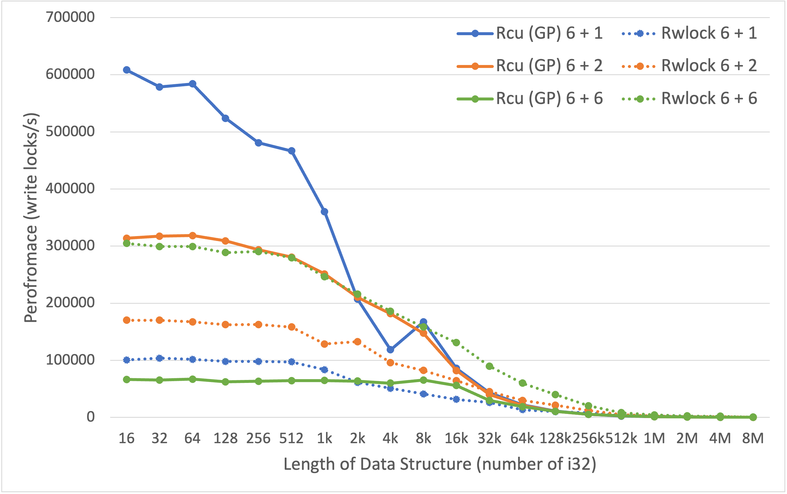

#  RCU in RUST (Course Project)

## Goal:
This project provides an RCU_cell that can replace the stock  std::sync::RwLock. RCU_cell provides a concurrent data structure for read-intensive jobs. The speed of acquiring the reading lock is 10X faster than the RwLock.  

The following table highlights the top differences between RCU_cell and RwLock. 

|  | RwLock  | RCU_Cell(GP)| RCU_Cell (QSBR) | 
| ------------- | ------------- | ------------- | ------------- |
| Speed of Read | Slow  | <code style="color : Darkorange">Fast</code> | <code style="color : Darkorange">Nearly Zero-Cost</code> ||
| Speed of Write | Slow and block readers | Slow  | Slow |
|Writer starvation|No|No|No|
|Partial update|<code style="color : Darkorange">Yes</code>|No|No|
|Easy to use |Yes|Yes|No|

## Performance:
You can find the benchmark code in 'src/bins/benchmark.rs' and 'src/bins/benchmarkRW.rs'. 

The below figures show the reading lock performance. The data was collected on Apple M2Max. In the figure, '6 + 0'  stands for six reader threads and zero writers. 


The below figures show the Write lock performance. 


In Summary, our library is at least one order of magnitude faster than RWlock in terms of reading Lock. The reading performance won't drop when having more writers. 
## How it works 

If you look inside the 'rcu_gp.rs' you will find a shared data struct likes the following one:
```rust
pub struct RcuGPShared<T> {
    thread_counter: AtomicU32, // For RCU
    global_ctr: AtomicU32,
    thread_ctr: Vec<AtomicU32>,

    data_ptr: AtomicPtr<T>,     // For Readers
    data: Mutex<Box<UnsafeCell<T>>>, // For Writers
}
```
In the above code, ```data``` manages the shared ownership and will only be accessed by writers. ```data_ptr``` is a fast reading cache that all readers will go to. The **RCU** algorithm will be responsible for ensuring that the data that ```data_ptr``` points to won't be edited or dropped when any reader is using the shared data. 

The Difference between the 'rcu_gp.rs' and 'rcu_gp_ptr.rs' is that in 'rcu_gp_ptr.rs', the ownership is managed by the ```data_ptr``` (Like RCU in C/C++). 

## Run Example codes 
Please runs 'src/bins/benchmark.rs' with ```cargo run -r --bin benchmark```. You will see the benchmark result of one size in 10 sceonds.

## Use our code in your library 
We implemented several algorithms of RCU. To begin with, We recommend you try the 'rcu_gp_ptr.rs' first. 

### Loading the Library 
```rust
use rcu::rcu_gp_ptr as rcu_gp;
```
### Creating a Shared Object
```rust
 let mut tokens = rcu_gp::RcuCell::gen_tokens(num_of_tokens, protected_data);
```
The Above code creates multiple RCUCells for the protected data. Each threads will need a instnace of RCUCell to acesss or update the protected data
### Reading the Shared Object
```rust
fn thread_reader(rcu_cell: rcu_gp::RcuCell<Node>)
{
let guard = rcu_cell.read();
// reads from guard
}
```
The above code creates a read guard of the protected data. The guard implements ```deref``` and can be used to access the protected data. During the lifetime of this guard, the protected data won't be changed or dropped. 
### Updating the Shared Object
```rust
fn thread_writer(rcu_cell: rcu_gp::RcuCell<Node>)
{
    //gen a New Node
    let guard = rcu_cell.replace(new_node);
}
```
The above code shows how to modify the protected data. In RCU, you will need to create a new object and replace the old one. After the replacement, you will have a write guard. The writeGuard will delete the old data when it ```drop``` You can also use ```get_old``` to get the old protected data. Both the drop and ```get_old``` will result in a ```rcu_synchonization```
## Limitation

Our implementation requires the user to provide the number of threads in the system when creating the 'RcuCell'. However, C/C++ implementation usually allows dynamically adding and removing threads. However, this feature requires a RCU_list which we haven't finshed. 

